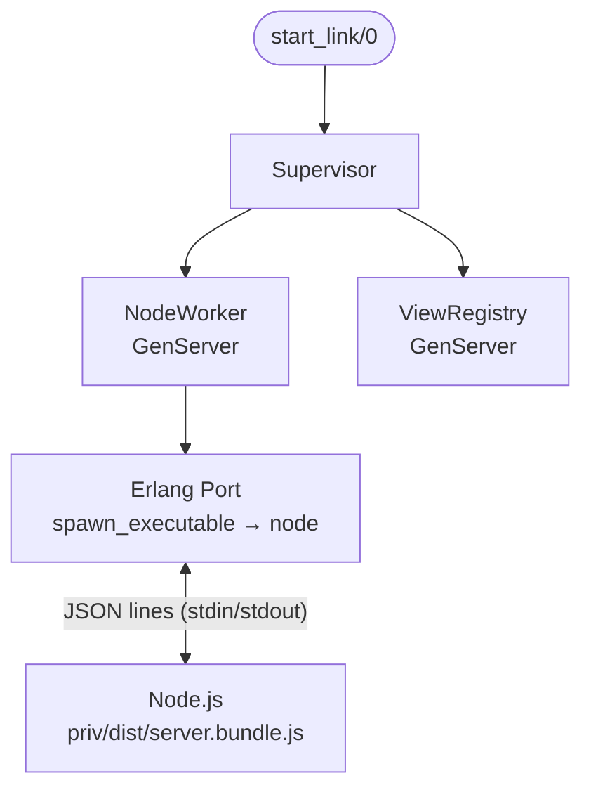

# PhoenixTestJsdom

Run Phoenix tests against JSDom for lightweight JavaScript integration testing. Compatible with Phoenix LiveView. PhoenixTest support included. Inspired by Testing Library.


:::warn
This library is highly experimental and APIs are still changing.
:::

## Features

- `PhoenixTest.Driver` protocol implementation
- Bundled JSDom, no npm install required. Node execution and package loading is fully configurable
- Async test support with isolated JSDom instances
- LiveViewTest interop
- Static Phoenix controller support
- Event firing, user interactions, form submissions

## Install

```elixir
def deps do
  [
    {:phoenix_test_jsdom, "~> 0.1.0", only: :test}
  ]
end
```

All Node.js dependencies are bundled into a single file and shipped with the hex package — no `npm install` step is needed.

## Quickstart

```elixir
defmodule MyApp.FeatureTest do
  use MyAppWeb.ConnCase, async: true

  setup_all do
    start_supervised(PhoenixTestJsdom)
    :ok
  end

  test "Able to click a react rendered counter", %{conn: conn} do
    {:ok, view, _} = live(conn, "/react-counter") |> PhoenixTestJsdom.mount()

    html =
      view
      |> PhoenixTestJsdom.click("Increment", selector: "button")
      |> PhoenixTestJsdom.render()

    assert html =~ "Count: 1"
  end
end
```

## Usage


### Global startup (recommended)

```elixir
# test/test_helper.exs
{:ok, _} = PhoenixTestJsdom.start_link()
ExUnit.start()
```

### Per File Setup

```elixir

defmodule MyApp.MixedTest do
  use MyAppWeb.ConnCase

  setup_all do
    start_supervised(PhoenixTestJsdom)
    :ok
  end
  ...
end
```

### Using with `Phoenix.LiveViewTest`

```elixir
defmodule MyApp.MixedTest do
  use MyAppWeb.ConnCase
  import Phoenix.LiveViewTest

  # PhoenixTestJsdom — React hook requires real JS execution
  test "React hook updates the count", %{conn: conn} do
    {:ok, view, _} = live(conn, "/react-counter") |> PhoenixTestJsdom.mount()
    html =
      view
      |> PhoenixTestJsdom.click("Increment", selector: "button")
      |> PhoenixTestJsdom.render()
    assert html =~ "Count: 1"
  end
end
```

:::note
Regular LiveViewTest functions can be used to interact with the LiveView process, with jsdom remounting the updated HTML (note that this will result in local client state getting cleared). 
:::

### Using with `PhoenixTest`

```elixir
defmodule MyApp.MixedTest do
  use MyAppWeb.ConnCase
  import PhoenixTest

  test "navigates to about page", %{conn: conn} do
    conn
    |> visit("/")
    |> click_link("About")
    |> assert_has("h1", text: "About Us")
  end

  test "submits a form", %{conn: conn} do
    conn
    |> visit("/contact")
    |> fill_in("Name", with: "Aragorn")
    |> select("Elessar", from: "Aliases")
    |> choose("Human")
    |> check("Ranger")
    |> click_button("Submit")
    |> assert_has(".success", text: "Thanks!")
  end
end
```


## Configuration

```elixir
config :phoenix_test_jsdom,
  node_path: "/path/to/node",                 # to set a custom node path
  setup_files: ["/path/to/setupFile.js"]      # js files that will be run in JSDom context, useful for shims/stubs/mocks
  cwd: "../"        # to change working directory of the node process, useful for using your own jsdom version
```

## Architecture

Tests start this tree from `test_helper.exs` via `start_link/0`.



The library manages a persistent Node.js process that hosts JSDom instances. Each test can create isolated JSDom instances identified by unique IDs, enabling fully async test execution.

## Development

The Node.js server (`priv/server.js`) and its dependencies are bundled into a single file using Vite library mode.

```bash
npm install --prefix priv
npm run bundle --prefix priv # produces server.bundle.js
mix test

cd examples/hello && mix deps.get && npm ci --prefix assets && mix test
```
